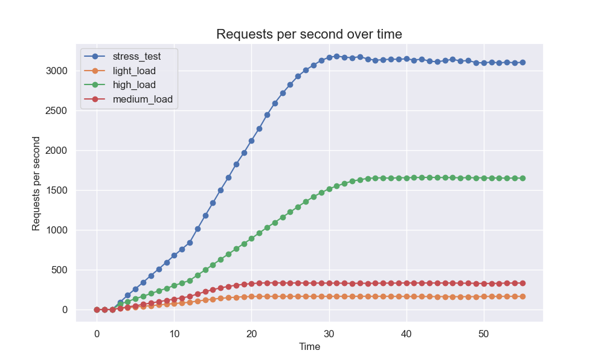
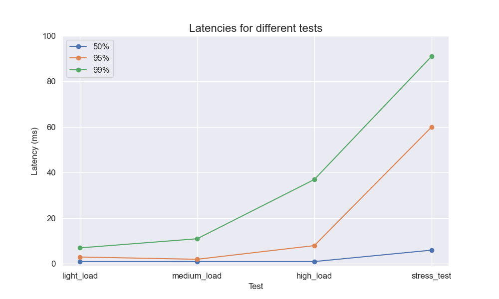

# Python ML API Load Testing

A simple load testing setup for Python ML APIs using Locust, with a jupyter notebook for analysis.

## Quick Start

1. **Start your API server:**
   ```bash
   uv run python run.py
   ```

2. **Make some calls**
    ```bash
    curl -X POST \
        -H "Content-Type: application/json" \
        -d '{"id_0": "bananas", "id_1": "blue", "id_2": "medium", "continuous_feature": 1.5}' \
        http://localhost:8080/predict
     ```

3. **Run load tests:**
   ```bash
   ./run_load_tests.sh
   ```

That's it! Check the `load_test_results/` directory and `analysis.ipynb` to analyze the results.

## What Gets Tested

The app serves predictions from a logistic regression model. For feature computation, it fetches a pre-computed feature matrix based on discrete request parameters. It also processes a continuous feature. 
The modelling is implemented on numpy, first it samples a set of regression coefficients from a pre-loaded posterior distribution. Then it performs a matrix multiplication followed by a sigmoid function. 

The api is built with FastAPI, and most operations are done via numpy. 

- **Light Load**: 50 users, 5 spawn rate, 60s
- **Medium Load**: 100 users, 10 spawn rate, 60s  
- **High Load**: 500 users, 20 spawn rate, 60s
- **Stress Test**: 1000 users, 50 spawn rate, 60s





## The blog post

You can find a brief explanation of why I did this, and the results I got in [this blog post](https://javiermas.medium.com/benchmarking-an-ml-service-in-pytho-4238399d2229).

